# AWS CloudTrail → Splunk Detection Lab

A hands-on cloud security lab that collects AWS CloudTrail logs in Splunk, simulates two cloud attack paths, detects them with SPL, and documents one incident investigation end to end.

It extends my earlier on-prem lab (Windows RDP brute force, Event ID 4625, Splunk Universal Forwarder) to the cloud, using the same analyst workflow: **Alert → Context → Evidence → Analysis → Severity → Decision → Documentation**.

> **Status:** completed as a lab. All AWS test resources were cleaned up afterwards, so this repository is documentation and evidence, not a running environment. All activity is a simulation in my own account.

---

## Architecture

```
 AWS account (us-east-1)
 ┌──────────────────────────────┐
 │ Console / API activity        │
 │   (root user, IAM, S3)        │
 └──────────────┬───────────────┘
                │ management events (read + write)
                ▼
 ┌──────────────────────────────┐
 │ CloudTrail: soc-lab-trail     │  multi-region, log file validation on
 └──────────────┬───────────────┘
                │ .json.gz log files
                ▼
 ┌──────────────────────────────┐
 │ S3 log bucket                 │
 └──────────────┬───────────────┘
                │ polled by Generic S3 input
                │ (read-only IAM user, scoped to this bucket)
                ▼
 ┌──────────────────────────────┐
 │ Splunk Enterprise (Windows)   │  Splunk Add-on for AWS
 │ index=aws_cloudtrail          │  sourcetype=aws:cloudtrail
 └──────────────┬───────────────┘
                ▼
        SPL detections → scheduled alerts → incident report
```

The ingestion pattern mirrors the Windows lab: a collector ships logs into the same Splunk instance, with a new source.

---

## What was built

| Step | Work | Result |
|---|---|---|
| 1 | AWS account, billing alert | $1 budget alert; root protected with a passkey (MFA) |
| 2 | CloudTrail trail | `soc-lab-trail`: multi-region, management events only, log file validation on, no KMS/SNS/CloudWatch to stay within free tier |
| 3 | Low-privilege IAM user | `lab-test-user`: no permissions, no console password, no access keys |
| 4 | Attack simulations | Public S3 bucket; IAM privilege escalation |
| 5 | Raw event review | Event history analysed field by field (see timelines below) |
| 6 | Splunk ingestion | Splunk Add-on for AWS, Generic S3 input, dedicated read-only IAM user |
| 7 | Detections | Four SPL detections tied to MITRE ATT&CK, all validated against real events |
| 8 | Incident report | [Public S3 bucket exposure](docs/incident-report-public-s3-bucket.md) |

---

## Scenario 1: public S3 bucket

A test bucket was created, its Block Public Access protections were removed, and a public `READ` grant was added for the `AllUsers` group. Everything was then reversed and the bucket deleted. Times are UTC.

| Time | Event | Detail |
|---|---|---|
| 18:54:29 | `CreateBucket` | Test bucket created |
| 18:56:21 | `PutBucketPublicAccessBlock` | All four protections set to `false` |
| 19:00:38 | `PutBucketAcl` | `AllUsers` granted `READ` |
| 19:02:09 | `PutBucketPublicAccessBlock` | All four set back to `true` |
| 19:03:55 | `PutBucketAcl` | Public grant removed |
| 19:28:43 | `DeleteBucket` | Bucket deleted |

| Window | Duration |
|---|---|
| Block Public Access off | 5 min 48 s |
| Public ACL grant present | 3 min 17 s |
| **Effective exposure** (overlap) | **about 1 min 31 s** |

The effective window assumes S3 behaves as documented, with `IgnorePublicAcls` neutralising public ACLs once re-enabled.

Full write-up: [docs/incident-report-public-s3-bucket.md](docs/incident-report-public-s3-bucket.md)

## Scenario 2: IAM privilege escalation

`AdministratorAccess` was attached to the low-privilege `lab-test-user`, then detached.

| Time (UTC) | Event | Detail |
|---|---|---|
| 19:09:01 | `AttachUserPolicy` | `arn:aws:iam::aws:policy/AdministratorAccess` attached to `lab-test-user` |
| 19:10:05 | `DetachUserPolicy` | Policy removed |

The user held full admin rights for **1 minute 4 seconds**. It had no console password and no access keys, so the rights could not be used during that window.

**A useful contrast:** the next morning I attached a custom read-only policy to a different user (`splunk-reader`). It produced the same event name (`AttachUserPolicy`) but a different `policyArn`, and the detection correctly ignored it. The policy ARN is what separates a legitimate attach from an escalation.

---

## Detections

| Detection | Fires on | MITRE ATT&CK |
|---|---|---|
| Admin policy attached to IAM user | `AttachUserPolicy` with the `AdministratorAccess` ARN | T1098.003 |
| S3 bucket ACL granted to public | `PutBucketAcl` with an `AllUsers` / `AuthenticatedUsers` grant | T1530 (enabled by the exposure) |
| S3 Block Public Access weakened | `PutBucketPublicAccessBlock` with any protection `false` | T1562 |
| S3 public exposure (correlated) | Both S3 signals on the same bucket within 15 minutes | T1530, T1562 |

Each search matched exactly the intended events when run over all time (one match each) and ignored the cleanup events and the benign `splunk-reader` attach. The correlated alert runs hourly and adds to Triggered Alerts when it returns results.

SPL, logic, false-positive notes, and known gaps: [docs/detections.md](docs/detections.md)

> The MITRE mappings are judgment calls. ATT&CK has no technique for "make a bucket public" itself, so T1530 is the access this exposure enables.

---

## Account hardening along the way

- Root user protected with a passkey; later sign-ins confirmed with `MFAUsed: Yes`.
- A dormant root access key (never used, roughly 5.7 years old) was found and deleted.
- $1 AWS Budgets alert set before any resources were created.
- Checked all enabled Regions in AWS Global View for leftover resources (none), and confirmed a $0.00 bill.
- The Splunk reader identity has a custom policy limited to listing and reading one bucket, not the broader sample policy in some tutorials (which includes `s3:Delete*`).

---

## Screenshots

Account IDs, canonical user ID, source IP, key IDs, and bucket names are redacted. AWS Event history records show **UTC**; Splunk displays **local time (UTC+2)**, so a Splunk time of 21:09:01 is 19:09:01Z.

### Collection

**CloudTrail trail.** `soc-lab-trail` is multi-region with log file validation enabled; KMS, SNS, and CloudWatch Logs are off, and recursive logging is on.

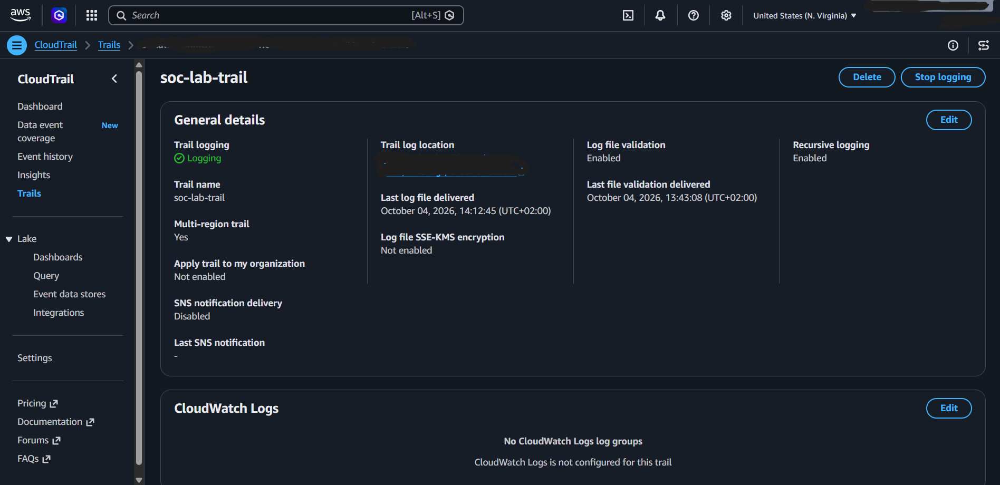

**CloudTrail dashboard.** The trail is logging. Insights is not enabled and there are no Lake queries, so no paid CloudTrail features are in use.

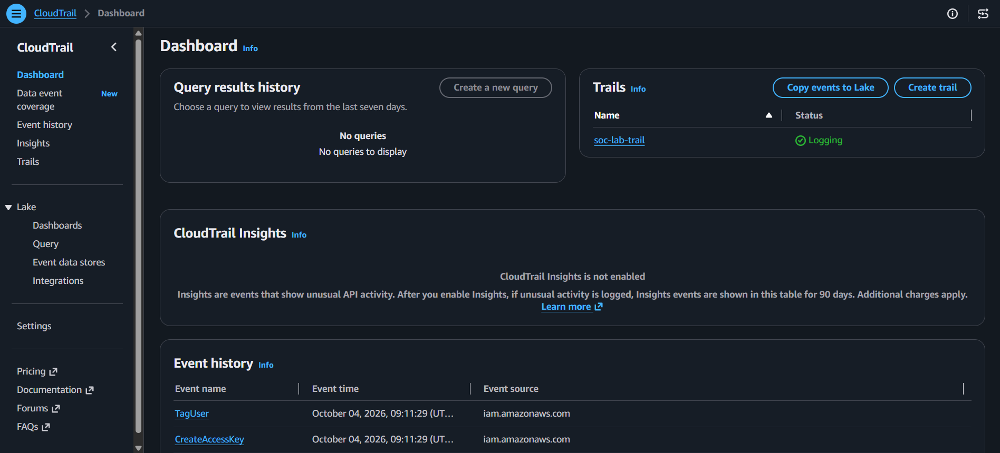

### Scenario 1: public S3 bucket

**Block Public Access removed (18:56:21Z).** All four protections set to `false`, which opens the exposure window.

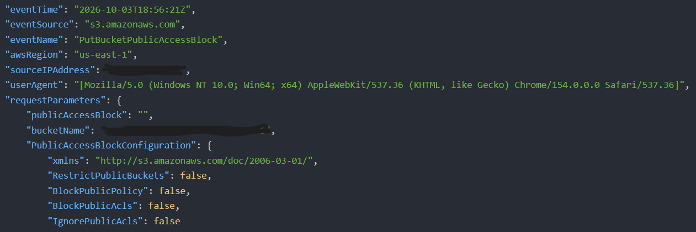

**Public ACL grant (19:00:38Z), record header.** The actor is the root user. `mfaAuthenticated` is `false` because the session began at 18:16:26Z, before the passkey was registered inside it at 18:31:18Z.

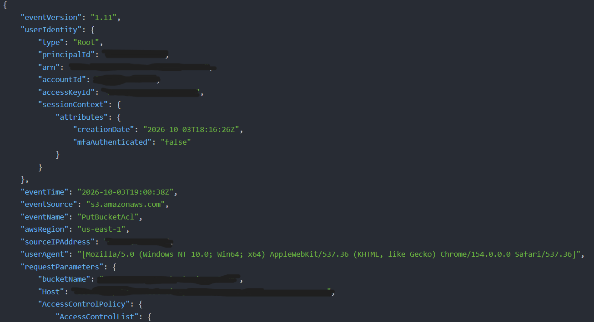

**Public ACL grant, grant block.** `AllUsers` is granted `READ`; the owner keeps `FULL_CONTROL`. The canonical user ID is redacted.

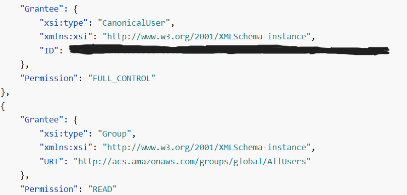

### Scenario 2: IAM privilege escalation

**`AdministratorAccess` attached to `lab-test-user` (19:09:01Z).**

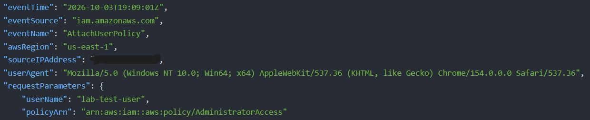

**Detached 64 seconds later (19:10:05Z).**

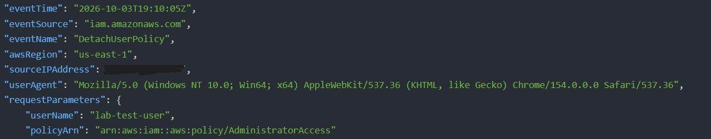

### Splunk ingestion and detections

**Splunk Add-on for AWS account.** The `splunk-reader` identity is a static-key, read-only IAM user scoped to the log bucket (key ID redacted).

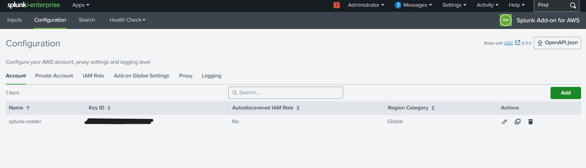

**Detection 1, admin policy attached (T1098.003).** One match over all time: `lab-test-user` with `AdministratorAccess`. The later benign attach for `splunk-reader` does not match because the policy ARN differs.

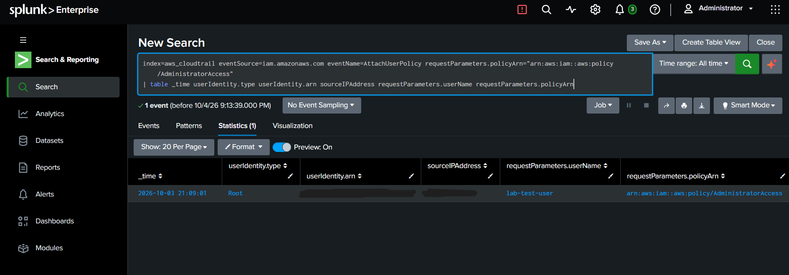

**Detection 2, public ACL granted (T1530).** One match, the 19:00:38Z grant. The cleanup saves have an empty ACL and do not match.

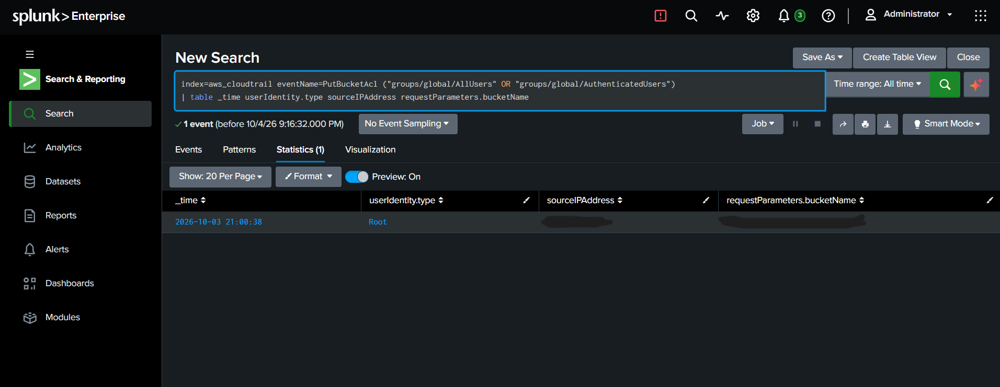

**Detection 3, Block Public Access weakened (T1562).** One match, the 18:56:21Z event.

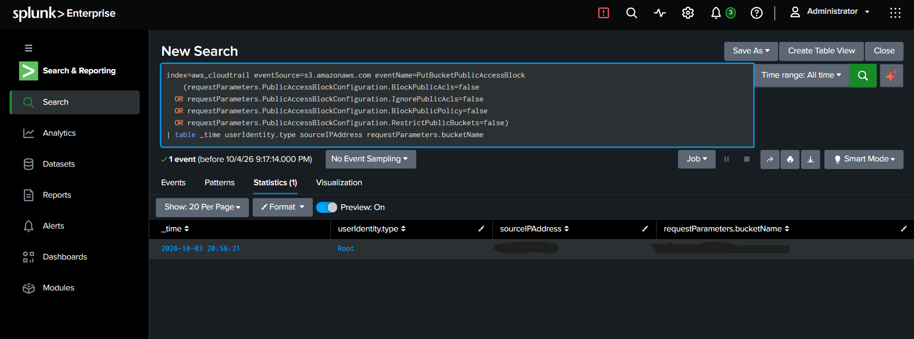

**Detection 4, correlated exposure (T1530, T1562).** Two matching events are aggregated into one row for the bucket, with both signals present, 4 minutes 17 seconds apart.

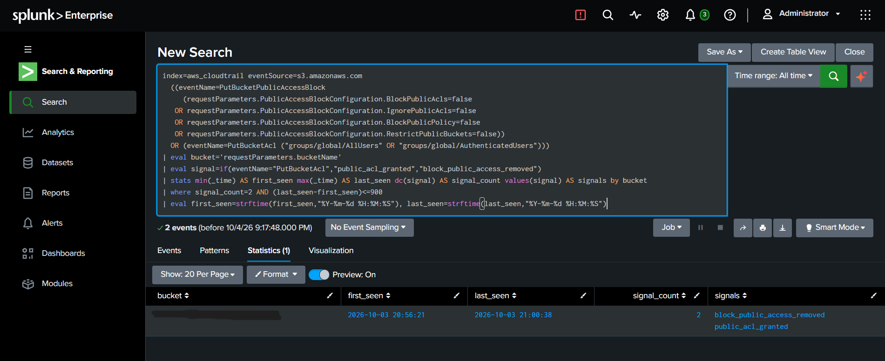

**Saved alert.** The correlated alert is enabled and scheduled hourly, triggers on more than 0 results, and adds to Triggered Alerts. "No fired events" is expected: its 1-hour lookback does not reach the previous day's lab events, which is why each detection was validated by running its search over all time.

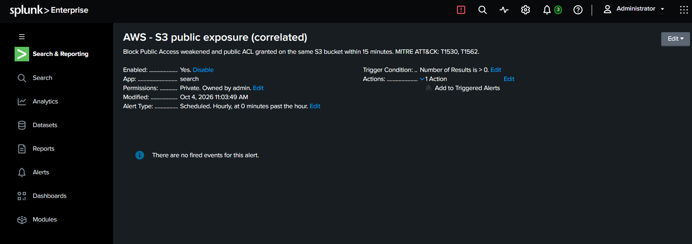

---

## Limitations

- **Management events only.** Without S3 data events I cannot show whether anyone listed or read the test bucket during the exposure. The bucket was empty, so no data was at risk.
- **Single account, single actor.** All events came from my own root session. There is no attacker traffic, so the false-positive and false-negative behaviour of these detections is untested at scale.
- **Alert lookback is 1 hour.** The saved alerts did not re-fire on the previous day's events, so I validated each detection by running its search over all time.
- **Trial licence.** Splunk Enterprise trial licences stop scheduled searches on expiry.
- **Polling ingestion.** The Generic S3 input polls the bucket instead of using SQS notifications, which is simpler but slower than the add-on's SQS-based option.
- **Root session ran without MFA.** The session began without MFA and the passkey was registered inside it (see the report), so events record `mfaAuthenticated: false`.

---

## Lessons learned

- Passkey registration happened in an existing session, so that session kept `mfaAuthenticated: false`. Registering MFA doesn't protect the session you're already in; sign out and back in.
- Detection fields matter more than tutorials suggest. A tutorial-style field like `aclGranted` does not exist in CloudTrail; the real signal is the grantee URI inside the `Grant` array, and `policyArn` replaces `policyName`.
- Service-initiated events look different from human ones (`invokedBy` set, service name as source IP and user agent). I used one such event as a baseline.
- The cleanup ACL saves were recorded with an empty grant list, so the detection has to key on the `AllUsers` grant inside the event, not on `PutBucketAcl` alone. Otherwise it would also fire on the cleanup.
- Troubleshooting that took real time: an AWS Settings login loop (resolved by using the classic console), a Splunk admin reset (`user-seed.conf` had been saved as a folder and a `.txt` file), and an alert whose lookback window did not cover the lab events.

---

## Repository layout

```
.
├── README.md
├── .gitignore
├── docs/
│   ├── incident-report-public-s3-bucket.md
│   └── detections.md
├── screenshots/          # 13 redacted images, referenced above
└── scripts/
    └── scan-for-secrets.sh   # run before every push
```

## Redaction and safety

Account IDs, canonical user IDs, source IPs, access key IDs, session keys, and the passkey serial number are replaced with placeholders (`<ACCOUNT_ID>`, `<REDACTED_IP>`, and so on). **Never commit access keys, secret keys, or a CSV of credentials.** Run `bash scripts/scan-for-secrets.sh` before every push; it checks the text files for AWS key IDs, account-ID-like numbers, canonical IDs, and IP addresses. It cannot read images, so every file in `screenshots/` was also checked by eye.

## Skills demonstrated

AWS CloudTrail, S3, and IAM fundamentals · least-privilege policy design · Splunk ingestion and SPL · detection engineering with MITRE ATT&CK mapping · alert tuning and correlation · incident investigation and reporting · honest scoping of limitations
